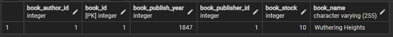
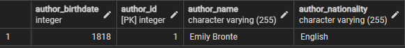
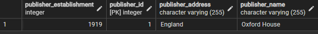
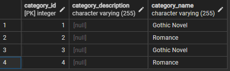
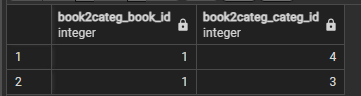

# Kütüphane Yönetim Sistemi

Bu Java projesi, kütüphane yönetim sistemi için bir veritabanı uygulamasıdır. Proje, JPA (Java Persistence API) kullanarak veritabanı işlemlerini yönetir ve Hibernate ile PostgreSQL veritabanı üzerinde çalışır.

## Gereksinimler

- Java 8 veya üstü
- PostgreSQL veritabanı

## Kurulum

1. Proje dosyalarını bilgisayarınıza klonlayın veya ZIP dosyasını indirin.
2. PostgreSQL veritabanı oluşturun ve bağlantı bilgilerinizi `application.properties` dosyasında güncelleyin.
3. Proje dosyalarını IntelliJ IDEA veya tercih ettiğiniz bir IDE'de açın.
4. Proje bağımlılıklarını otomatik olarak indirmek için Maven projesini yeniden yükleyin.
5. Projeyi calistirin.

## Kullanım

- Uygulama başlatıldığında, konsol üzerinden kullanıcı etkileşimi sağlanır.
- Kullanıcı, kitapları, üyeleri ve kütüphane işlemlerini yönetebilir.
- Kullanıcıların kitapları ödünç alması, iade etmesi ve kütüphane envanterini görüntülemesi sağlanır.

## Katkıda Bulunma

- Katkıda bulunmak veya sorunları raporlamak için GitHub'da bir issue açabilir veya bir pull isteği gönderebilirsiniz.

## Tablo Görüntüleri
* Book Table

* Author Table

* Publisher Table

* Category Table

* Book2Category Table

* Borrow Table

